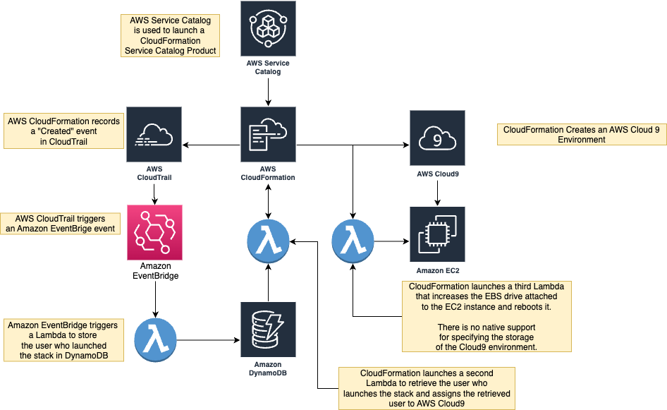

# AWS Service Catalog Cloud9 Deployment

This repository consists of a framework to deploy AWS Cloud 9 with AWS Service Catalog.

There are unique challenges with deploying Cloud 9 environments using Service Catalog.  When you provision Cloud 9 environments directly within the AWS Console or with [AWS CloudFormation](https://aws.amazon.com/cloudformation/), the environment is assigned to the logged in user's account and is only accessible by that user.

When deploying a Cloud 9 environment via Service Catalog, by default, the Cloud 9 environment is assigned to a Service Catalog service role that is inaccessible to the user. This solution works around that issue by capturing the user who launched the product by storing the relevant [AWS CloudTrail](https://aws.amazon.com/cloudtrail/) event and assigning the user to the Cloud 9 environment.

You also cannot specify the size of the underlying storage with CloudFormation.  This repository also includes a [CloudFormation custom resource](./cloud9-product/components/lambdas/lmd-csr-configure-cloud9-ec2-storage/) which modifies the size of the [attached Elastic Block Store volume](https://aws.amazon.com/ebs/) and allows the end user to specify the amount of storage needed for the Cloud 9 environment.  By default, Cloud 9 only allocates 10GB of storage.

## What is AWS  Service Catalog?

AWS Service Catalog lets you centrally manage your cloud resources to achieve governance at scale of your infrastructure as code (IaC) templates, written in CloudFormation or Terraform. With AWS Service Catalog, you can meet your compliance requirements while making sure your customers can quickly deploy the cloud resources they need.

## What is AWS Cloud 9?

[AWS Cloud9](https://aws.amazon.com/cloud9/) is a cloud-based integrated development environment (IDE) that lets you write, run, and debug your code with just a browser. It includes a code editor, debugger, and terminal. Cloud9 comes prepackaged with essential tools for popular programming languages, including JavaScript, Python, PHP, and more, so you don’t need to install files or configure your development machine to start new projects.


## Architecture



### Assigning the Cloud 9 environment to the logged in user

The architecture is based on the AWS blogpost [Tracking AWS Service Catalog products provisioned by individual SAML users](https://aws.amazon.com/blogs/mt/tracking-aws-service-catalog-products-provisioned-by-individual-saml-users/).

1. The user provisions the AWS Cloud 9 product after authenticating to AWS Service Catalog.
2. AWS Service Catalog launches an AWS CloudFormation template in response to the user’s request.
3. An AWS Lambda function ([lmd-csr-store-cft-deployer](./cloud9-product/components/lambdas/lmd-csr-store-cft-deployer/README.md)) is invoked based on the Amazon CloudWatch rule triggered by the CloudFormation CreateStack event.
4. ```lmd-csr-store-cft-deployer```function reads the Active Directory User Name and CloudFormation stack ID from the event record and stores this information in an Amazon DynamoDB database (```sc-track-user```).
5. The CloudFormation template provisions a custom resource that invokes the AWS Lambda function ([lmd-csr-get-cft-deployer](./cloud9-product/components/lambdas/lmd-csr-get-cft-deployer/)).
6. The Lambda function reads the user name from the Amazon DynamoDB record associated with the CloudFormation stack ID and returns this information back to the CloudFormation template.


## Deployed Resources

This repository is based on the [Service Catalog Framework](./FRAMEWORK_DEPLOYMENT.md).

It also includes Lambdas from the [CloudFormation data sources repository](./cloud9-product/components/lambdas/CFT_DATA_SOURCES)


## Prerequisites

### Tagging VPCs and Subnets

This solution uses two [CloudFormation custom resources](https://docs.aws.amazon.com/AWSCloudFormation/latest/UserGuide/template-custom-resources.html) to determine where the Cloud 9 EC2 instance should be deployed based on tags:

- [CFNGetVPCByTag](./cloud9-product/components/lambdas/lmd-csr-get-vpc-by-tag/README.md) By default, it looks for a VPC with a tag named ```Cloud9``` and with a value of ```True```.  This can be changed in the [Cloud9 CloudFormation template](./cloud9-product/cloud9-product.yml)
- [CFNGetSubnesByTag](./cloud9-product/components/lambdas/lmd-csr-get-subnet-by-tag/README.md): By default, it looks for a subnet with a tag named ```Cloud9``` and with a value of ```True```.  This can be changed in the [Cloud9 CloudFormation template](./cloud9-product/cloud9-product.yml)


## Deployment

### Using AWS CloudShell

The most straightforward method to deploy this solution involves logging into your AWS account with the appropriate permissions and using [AWS CloudShell](https://aws.amazon.com/cloudshell/)

Log into your AWS account, navigate to the Cloudshell page and clone the repository.

```bash
# Deploy the Lambdas
bash deploy.sh
```

### Deploying locally

#### Prerequisites

- [AWS SAM prerequisites](https://docs.aws.amazon.com/serverless-application-model/latest/developerguide/prerequisites.html) 
- [Docker Desktop](https://www.docker.com/products/docker-desktop/) When deploying locally instead of using CloudShell, the deployment script uses Docker to build the Lambdas with the proper dependencies.

From the terminal, after you clone the repository, run the following commands.

```bash
# Deploy the Lambdas
bash deploy.sh
```

## Framework Documentation

- [Service Catalog Overview](./SERVICE_CATALOG_OVERVIEW.md) - describes the AWS Service Catalog service.
- [Using Service Catalog](./USING_SERVICE_CATALOG.md) - a walkthrough of the end user experience when provisioning products.
- [Service Catalog Administration Guide](./SERVICE_CATALOG_ADMINSTRATION_OVERVIEW.md) - describes how to administer Service Catalog portfolios.
- [Framework Deployment](./FRAMEWORK_DEPLOYMENT.md) - a step by step guide detailing the AWS resources that get deployed and how to deploy the framework.


