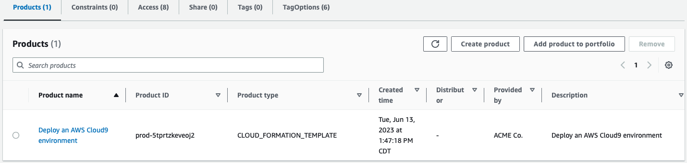

# Managing Service Catalog Portfolios

As an administrator, you can manage your Service Catalog Portfolios via the web console.

A Service Catalog *portfolio* contains a list of products. Navigate to the ```Service Catalog``` web page and then click on ```Portfolios``` on the side.

## Products

The first tab displays a list of products contained in the portfolio.



## Access

The ```Access``` tab is how you give a user access to a Portfolio by specifying IAM [groups, users, or roles](https://docs.aws.amazon.com/IAM/latest/UserGuide/id.html).

Even if a user has permissions to Service Catalog itself via IAM permissions, you must explicitly give a user access to a portfolio.

By default, when you deploy the framework, any role that has either the ```ServiceCatalogEndUser``` or ```ServiceCatalogAdmin``` [managed policy](https://docs.aws.amazon.com/IAM/latest/UserGuide/access_policies_managed-vs-inline.html) will be given access to the portfolio. You can include more policies by modifying the [Service Catalog CloudFormation template](./components/service-catalog-portfolios/service-catalog-portfolio.yml).